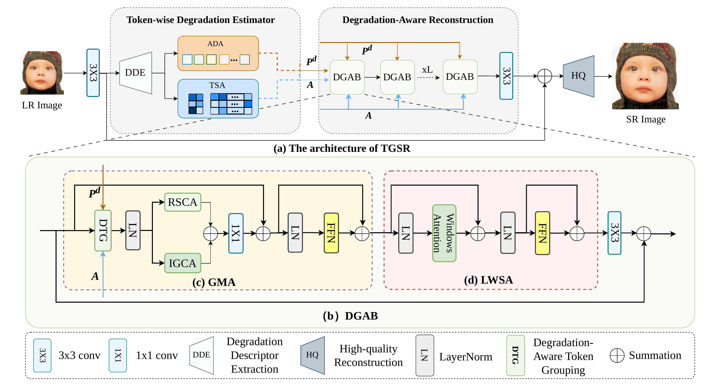

# TGSR: Degradation-Aware Token Grouping for Lightweight Blind Image Super-Resolution

Official PyTorch implementation of **TGSR**, a lightweight blind image super-resolution method that organizes reconstruction tokens according to learned degradation-conditioned restoration states.

## Contents

- [Method](#method)
- [Installation](#installation)
- [Data preparation](#data-preparation)
- [ImageNet-Test-100](#imagenet-test-100)
- [Inference](#inference)
- [Model inspection](#model-inspection)
- [Repository structure](#repository-structure)
- [Release status](#release-status)
- [Citation](#citation)
- [Acknowledgements](#acknowledgements)

## Method

<p align="center">
  
</p>

The vector version is available [here](assets/tgsr_framework.pdf).

TGSR follows a **TDE to DAR** pipeline:

1. **Token-wise Degradation Estimator (TDE).** Degradation Descriptor Extraction collects degradation evidence while preserving token correspondence. Adaptive Degradation Aggregation summarizes the descriptors into image-adaptive degradation-conditioned restoration states, and Token-wise State Assignment associates each reconstruction token with these states.
2. **Degradation-Aware Reconstruction (DAR).** The states and assignments estimated once by TDE are shared by all reconstruction blocks, keeping the reconstruction process conditioned on the same degradation representation.
3. **Degradation-Aware Grouped Attention Block (DGAB).** Each block combines Intra-Group Self-Attention, Inter-Group Cross-Attention, and Lightweight Window-based Self-Attention to model within-group dependencies, exchange information across groups, and refine local context.

The implementation can return the TDE descriptors, assignments, states, and assignment logits for controlled analyses and visualization.

## Installation

Python 3.10 or later and PyTorch 2.0 or later are recommended.

```bash
git clone https://github.com/2cr266/TGSR.git
cd TGSR

conda create -n tgsr python=3.10 -y
conda activate tgsr
pip install -r requirements.txt
```

## Data preparation

The manuscript uses DIV2K and Flickr2K for training. Standard synthetic evaluations use Set5, Set14, BSD100, and Urban100. Real-world evaluation uses RealSR and a fixed 100-image subset of the ImageNet-Test data released with ResShift.

A minimal dataset layout is:

```text
datasets/
├── DIV2K/
│   └── HR/
├── Flickr2K/
│   └── HR/
├── Set5/
│   ├── HR/
│   └── LR/
├── Set14/
├── B100/
├── Urban100/
└── RealSR/
```

The low-resolution inputs for controlled synthetic tests should be generated with the degradation settings reported in the manuscript. Training and test data are not redistributed by this repository.

## ImageNet-Test-100

Following ResShift, we use its released ImageNet-Test data. Our evaluation subset is selected reproducibly from the 3,000 released HR images as follows:

- sort all HR filenames lexicographically;
- sample 100 indices without replacement with `numpy.random.RandomState(0)`;
- apply no manual or content-based filtering;
- use the same fixed subset for every compared method.

The exact [100-image filename list](data/imagenet_test_100.txt) and the full [selection manifest](data/imagenet_test_100.json) are included. The manifest records the seed, sampling rule, candidate count, and SHA-256 hash of the ordered 3,000-image candidate list.

Reproduce the list directly from the released ZIP archive or an extracted directory:

```bash
python scripts/select_imagenet_test_100.py /path/to/imagenet512.zip
```

The script reads the archive index directly, so extraction is optional. Matching basenames identify the paired HR and LR images.

## Inference

Run TGSR on one low-resolution image:

```bash
python inference.py \
  --input datasets/Set5/LR/baby_x4.png \
  --output outputs/baby_x4_tgsr.png \
  --checkpoint checkpoints/tgsr_x4.pth.tar \
  --scale 4
```

Use `--device cpu` when CUDA is unavailable. The checkpoint loader accepts a plain state dictionary or dictionaries stored under `state_dict` or `model`.

## Model inspection

The following smoke test verifies the main TDE to DAR forward path and checks the SR output, token assignments, and restoration-state shapes:

```bash
python -m test.smoke_test
```

To access intermediate outputs in Python:

```python
import torch
from model import TGSR

model = TGSR(upscale=4).eval()
lr = torch.rand(1, 3, 32, 32)

with torch.inference_mode():
    sr, auxiliary = model(lr, return_vis=True)

assignments = auxiliary["tde"]["assignments"]
states = auxiliary["tde"]["states"]
```

## Repository structure

```text
TGSR/
├── assets/                         # framework figure
├── data/                           # ImageNet-Test-100 list and manifest
├── datasets/                       # sample Set5 images
├── model/
│   ├── TGSR.py                     # TDE, DAR, DGAB, and TGSR
│   └── losses.py                   # degradation contrastive loss
├── scripts/
│   └── select_imagenet_test_100.py
├── test/
│   └── smoke_test.py
├── utils/
├── inference.py
└── requirements.txt
```

## Release status

- [x] TGSR architecture and intermediate-assignment export
- [x] Reproducible ImageNet-Test-100 selection and exact filename list
- [x] Single-image inference entry point
- [ ] Final pretrained checkpoints
- [ ] Full training and benchmark evaluation configurations

The remaining artifacts will be added after final verification.

## Citation

If this work is useful for your research, please cite:

```bibtex
@misc{chen2026tgsr,
  title  = {TGSR: Degradation-Aware Token Grouping for Lightweight Blind Image Super-Resolution},
  author = {Jimin Chen and Rui Cao and Xianhong Wen and Sheng Ren},
  year   = {2026},
  note   = {Manuscript}
}
```

## Acknowledgements

This repository builds on ideas and utilities from the open-source blind super-resolution community, including CATANet, DCLS, and ResShift. We thank the authors for making their work publicly available.
